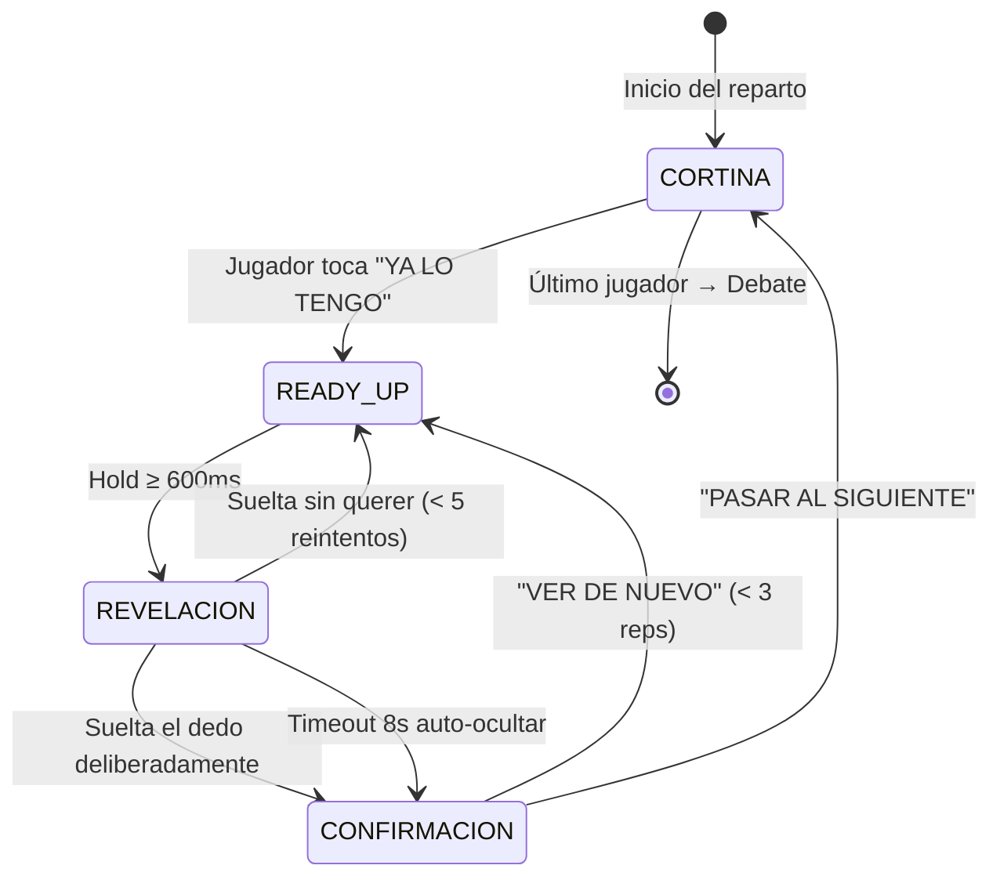
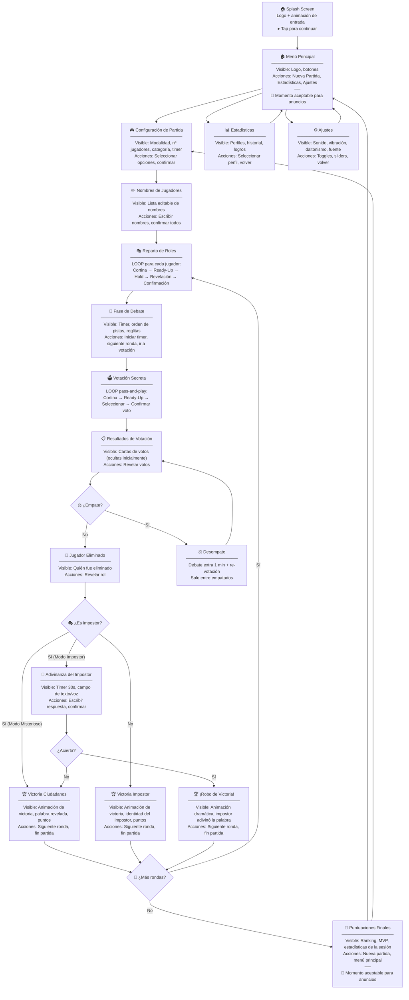
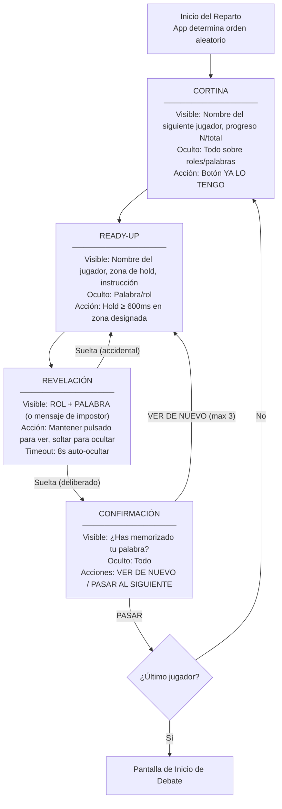
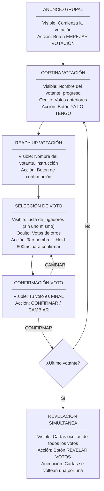

# El Impostor — UX/UI Architecture Specification

> Agente 1 · Diseño de interacción pass-and-play · Revelación segura · Votación secreta

---

## 0. Principios de Diseño

| Principio | Implicación |
|---|---|
| **Seguridad ante todo** | La información sensible NUNCA es visible sin 2 acciones deliberadas |
| **Una sola mano** | Todo alcanzable con el pulgar en posición natural (zona inferior 2/3 de pantalla) |
| **Zero-tutorial** | Cada pantalla contiene las instrucciones exactas de lo que hay que hacer |
| **Feedback multicanal** | Vibración + sonido + visual = la confirmación no depende de un solo sentido |
| **Inclusivo** | Alto contraste, modo daltonismo, fuentes escalables, sin dependencia del color |

---

## 1. Sistema de Revelación Segura

### 1.1 Mecánica: Hold-to-Reveal (mantener pulsado)

Se descarta *tap-to-reveal* (un toque accidental revelaría la palabra). Se descarta *swipe* (demasiado fácil de activar). La mecánica elegida es **hold-to-reveal**: mantener pulsado un área designada durante ≥ 600 ms para mostrar la palabra.

### 1.2 Estados de Pantalla — Fase de Reparto

Cada jugador atraviesa exactamente **5 estados** en secuencia estricta:

```
ESTADO 1          ESTADO 2          ESTADO 3          ESTADO 4          ESTADO 5
CORTINA     →     READY-UP     →    REVELACIÓN   →    CONFIRMACIÓN →   CORTINA
(jugador N-1)     (jugador N)       (jugador N)       (jugador N)      (jugador N+1)
```

---

#### Estado 1 — CORTINA (Pantalla de Transición)

```
┌─────────────────────────────────────┐
│                                     │
│         🔄  PASA EL MÓVIL          │
│                                     │
│      ┌─────────────────────┐        │
│      │                     │        │
│      │    JUGADOR  3       │        │
│      │    ─────────        │        │
│      │    María            │        │
│      │                     │        │
│      └─────────────────────┘        │
│                                     │
│   Toca el botón cuando tengas       │
│   el dispositivo en tus manos       │
│                                     │
│  ┌─────────────────────────────┐    │
│  │                             │    │
│  │      ☑  YA LO TENGO        │    │
│  │                             │    │
│  └─────────────────────────────┘    │
│                                     │
│         3 / 6 jugadores             │
│                                     │
└─────────────────────────────────────┘
```

**Contenido visible:** Nombre/número del siguiente jugador, progreso (3/6), instrucción contextual.
**Contenido oculto:** Absolutamente todo sobre roles y palabras.
**Acción requerida:** Pulsar botón "YA LO TENGO" (zona inferior, alcanzable con pulgar).
**Seguridad:** Esta pantalla NO contiene ninguna información sensible. Es segura para ser vista por cualquiera.

---

#### Estado 2 — READY-UP (Preparación para Revelación)

```
┌─────────────────────────────────────┐
│                                     │
│         👁  TU TURNO                │
│                                     │
│      Jugador 3 · María              │
│                                     │
│                                     │
│                                     │
│   ┌─────────────────────────────┐   │
│   │                             │   │
│   │   MANTÉN PULSADO AQUÍ      │   │
│   │   para ver tu palabra      │   │
│   │                             │   │
│   │       👆                    │   │
│   │                             │   │
│   │   ░░░░░░░░░░░░░░░░░░░░░░   │   │
│   │   (barra de progreso)       │   │
│   │                             │   │
│   └─────────────────────────────┘   │
│                                     │
│   Asegúrate de que nadie más        │
│   pueda ver la pantalla             │
│                                     │
└─────────────────────────────────────┘
```

**Contenido visible:** Identidad del jugador, instrucciones, zona de pulsación.
**Contenido oculto:** Palabra/rol.
**Acción requerida:** Mantener pulsado ≥ 600 ms en la zona designada.
**Feedback:** Una barra de progreso se llena durante 600 ms. Vibración corta (50 ms) al completarse.
**Seguridad:** Dos pasos deliberados ya realizados (botón "YA LO TENGO" + hold 600 ms).

---

#### Estado 3 — REVELACIÓN (Palabra Visible)

```
┌─────────────────────────────────────┐
│                                     │
│   ┌─────────────────────────────┐   │
│   │       CIUDADANO             │   │
│   │                             │   │
│   │                             │   │
│   │       🎸                    │   │
│   │                             │   │
│   │     GUITARRA                │   │
│   │                             │   │
│   │                             │   │
│   │   ─── suelta para ocultar  │   │
│   └─────────────────────────────┘   │
│                                     │
│   Memoriza tu palabra.              │
│   No la digas en voz alta.          │
│                                     │
└─────────────────────────────────────┘
```

**Variante Impostor (Modo Clásico):**
```
┌─────────────────────────────────────┐
│   ┌─────────────────────────────┐   │
│   │     ❓ IMPOSTOR             │   │
│   │                             │   │
│   │     No tienes palabra.      │   │
│   │     Haz como si la          │   │
│   │     conocieras.             │   │
│   │                             │   │
│   │   ─── suelta para ocultar  │   │
│   └─────────────────────────────┘   │
└─────────────────────────────────────┘
```

**Variante Impostor (Modo Misterioso):**
```
┌─────────────────────────────────────┐
│   ┌─────────────────────────────┐   │
│   │     ❓ IMPOSTOR             │   │
│   │                             │   │
│   │       🎻                    │   │
│   │     UKULELE                 │   │
│   │                             │   │
│   │   Tu palabra es DIFERENTE   │   │
│   │   a la del resto.           │   │
│   │                             │   │
│   │   ─── suelta para ocultar  │   │
│   └─────────────────────────────┘   │
└─────────────────────────────────────┘
```

**Contenido visible:** Rol + palabra (o mensaje de impostor).
**Acción requerida:** Mantener pulsado. Al soltar → oculta instantáneamente.
**Feedback:** Vibración continua suave mientras se muestra (pulso cada 800 ms). Sonido tonal grave constante (opcional, controlado por ajustes).
**Timeout de seguridad:** Si el jugador mantiene pulsado > 8 segundos, se oculta automáticamente + vibración larga de aviso (previene que dejen el dedo puesto y alguien se acerque).

---

#### Edge Case: Suelta el dedo sin querer

**Solución: Reintento inmediato (sin bloqueo).**

- Al soltar, la palabra desaparece instantáneamente (< 16 ms, mismo frame).
- Se vuelve al **Estado 2** (Ready-Up) de forma inmediata.
- El jugador puede volver a mantener pulsado sin esperas.
- **No hay bloqueo temporal** porque no introduce riesgo de seguridad (la información ya se ocultó).
- Se permite un máximo de **5 reintentos** antes de pasar automáticamente al Estado 4 (Confirmación), evitando loops infinitos por un niño jugando con la pantalla.

---

#### Estado 4 — CONFIRMACIÓN

```
┌─────────────────────────────────────┐
│                                     │
│                                     │
│       ✅  ¿Has memorizado           │
│           tu palabra?               │
│                                     │
│                                     │
│  ┌──────────────┐ ┌──────────────┐  │
│  │              │ │              │  │
│  │  🔄 VER DE  │ │  ➡️ PASAR AL │  │
│  │    NUEVO     │ │  SIGUIENTE   │  │
│  │              │ │              │  │
│  └──────────────┘ └──────────────┘  │
│                                     │
│                                     │
└─────────────────────────────────────┘
```

**Contenido visible:** Confirmación + dos opciones.
**Contenido oculto:** Todo sobre palabras/roles.
**Acciones:**
- "VER DE NUEVO" → Vuelve al Estado 2 (Ready-Up). Máximo 3 repeticiones.
- "PASAR AL SIGUIENTE" → Avanza al Estado 1 (Cortina) para el siguiente jugador.
**Feedback:** Vibración doble corta al confirmar paso al siguiente.

---

#### Estado 5 — CORTINA (para el siguiente jugador)

Idéntico al Estado 1, pero con el número del siguiente jugador. Si era el último jugador, transiciona a la **Pantalla de Inicio de Debate**.

---

### 1.3 Diagrama de Estados — Revelación



---

## 2. Pantallas de Transición ("Cortinas")

### 2.1 Diseño Visual

Las cortinas son pantallas **completamente opacas** con un color sólido vibrante (configurable en ajustes: azul oscuro por defecto, adaptable a modo alto contraste).

#### Reglas de la Cortina

| Regla | Descripción |
|---|---|
| **Contenido cero** | No se muestra absolutamente nada del estado anterior o posterior |
| **Sin animación de entrada** | La cortina aparece instantáneamente (sin fade-in que podría revelar contenido) |
| **Animación de salida** | Efecto de "cortina que se levanta" hacia arriba al tocar el botón |
| **Instrucciones contextuales** | Cada cortina dice exactamente qué hacer ahora |
| **Sin cuenta atrás** | No se usa cuenta atrás (genera presión innecesaria al pasar el móvil) |

### 2.2 Protocolo Anti-Vistazo Rápido

El problema: cuando el jugador anterior entrega el dispositivo, el receptor podría ver información residual en el breve instante del traspaso.

**Solución de 2 pasos obligatorios:**

```
Paso 0: La CORTINA ya está visible (no hay nada que espiar)
Paso 1: Botón "YA LO TENGO" (confirma que el jugador correcto tiene el dispositivo)
Paso 2: Hold 600ms en zona designada (acción deliberada para revelar)
```

La información sensible está separada del momento de la entrega por **mínimo 2 acciones deliberadas**. Incluso un vistazo rápido al tomar el dispositivo solo mostraría la cortina opaca.

### 2.3 Cortinas por Contexto

| Momento | Texto de la cortina | Color |
|---|---|---|
| Reparto de roles | "Pasa el móvil a [Jugador N]" | Azul oscuro |
| Votación | "Pasa el móvil a [Jugador N] para votar" | Rojo oscuro |
| Adivinanza del impostor | "Pasa el móvil al impostor eliminado" | Naranja oscuro |
| Entre rondas | "Ronda terminada · Pasa al líder para continuar" | Morado oscuro |

---

## 3. Feedback Multisensorial

### 3.1 Tabla de Eventos de Feedback

| Evento | Vibración | Sonido | Visual |
|---|---|---|---|
| Botón "YA LO TENGO" pulsado | Tic corto (30 ms) | Click suave | Botón se anima (escala 1.0 → 0.95 → 1.0) |
| Hold en progreso (600 ms) | — | — | Barra de progreso llenándose |
| Palabra revelada | Tic doble (50+50 ms) | Tono agudo corto ("pip") | Área de revelación se ilumina con glow |
| Palabra oculta (soltar) | Tic corto (30 ms) | Tono grave corto | Desaparición instantánea (0 ms transición) |
| Confirmación "PASAR" | Vibración doble (80+80 ms) | Sonido de "whoosh" | Animación de cortina cayendo |
| Voto registrado | Vibración larga suave (150 ms) | Campana sutil | Checkmark animado ✅ |
| Resultados revelados | Vibración patrón (corta-larga-corta) | Fanfarria/sonido dramático | Animación de revelación de cartas |
| Timer a punto de acabar | Vibración rítmica cada 1s | Ticking acelera | Barra de timer parpadea en rojo |

### 3.2 Diseño para Entornos Extremos

| Entorno | Canal primario | Canal secundario |
|---|---|---|
| **Fiesta ruidosa** | Vibración háptica | Visual (animaciones grandes, alto contraste) |
| **Aula silenciosa** | Visual | Vibración (sonido deshabilitado) |
| **Exterior con sol** | Vibración | Sonido (pantalla poco visible) |

**Ajustes de usuario:**
- 🔊 Sonido: On / Off / Solo efectos clave
- 📳 Vibración: On / Off
- 🌙 Modo silencioso: Desactiva todo excepto visual
- ☀️ Modo exterior: Aumenta contraste + vibración

### 3.3 Accesibilidad

| Requisito | Implementación |
|---|---|
| **Daltonismo** | Los roles NO se diferencian solo por color. Se usan formas + texto + iconos. Ciudadano = ✅ escudo. Impostor = ❓ interrogación. Modo daltonismo activa paleta segura (azul/naranja). |
| **Fuente dinámica** | Soporta el escalado del sistema operativo (Dynamic Type en iOS, sp en Android). Tamaño mínimo: 18sp para texto de juego, 24sp para la palabra clave. |
| **Alto contraste** | Contraste mínimo WCAG AA (4.5:1 para texto, 3:1 para elementos interactivos). Modo alto contraste opcinal con ratio 7:1. |
| **Motor reducido** | Opción "Reducir movimiento": desactiva animaciones, las transiciones son instantáneas (cortes). |

---

## 4. Flujo de Votación Secreta

### 4.1 Diseño de la Mecánica

La votación usa la misma mecánica pass-and-play que el reparto de roles, pero adaptada para seleccionar un jugador en vez de ver una palabra.

#### Secuencia Completa de Votación

```
1. ANUNCIO       → Pantalla grupal: "Comienza la votación"
2. CORTINA       → "Pasa el móvil a [Jugador N] para votar" (idéntica a reparto)
3. READY-UP      → Jugador toca "YA LO TENGO"
4. SELECCIÓN     → Lista de jugadores para votar + hold-to-confirm
5. CONFIRMACIÓN  → "¿Estás seguro? Tu voto es FINAL"
6. CORTINA       → Siguiente jugador
7. (Se repite 2-6 para cada jugador)  
8. REVELACIÓN    → Todos los votos revelados simultáneamente
```

### 4.2 Pantalla de Selección de Voto — Estado 4

```
┌─────────────────────────────────────┐
│                                     │
│    🗳  VOTACIÓN · Jugador 3         │
│    María                            │
│                                     │
│    ¿Quién crees que es              │
│    el impostor?                     │
│                                     │
│  ┌─────────────────────────────┐    │
│  │  ○  1. Carlos               │    │
│  │  ○  2. Ana                  │    │
│  │  ○  3. María  (TÚ) ← gris  │    │
│  │  ○  4. Pedro                │    │
│  │  ○  5. Lucía                │    │
│  │  ○  6. Pablo                │    │
│  └─────────────────────────────┘    │
│                                     │
│  Selecciona un nombre y luego       │
│  mantén pulsado para confirmar      │
│                                     │
│  ┌─────────────────────────────┐    │
│  │  MANTÉN PULSADO PARA VOTAR  │    │
│  │  ░░░░░░░░░░░░░░░░░░░░░░░░  │    │
│  └─────────────────────────────┘    │
│                                     │
└─────────────────────────────────────┘
```

**Cómo funciona:**
1. El jugador **toca un nombre** de la lista (tap normal). Se resalta.
2. Luego **mantiene pulsado** el botón inferior (hold 800 ms) para confirmar el voto.
3. **Hold más largo que en revelación** (800 ms vs. 600 ms) para evitar votos accidentales.
4. **No se puede votar a uno mismo** (su nombre aparece en gris, no seleccionable).
5. **Sin información previa:** No se muestra ningún indicador de votos anteriores. Cada votante ve la misma pantalla limpia.

### 4.3 Protección contra Espionaje de Votos

| Riesgo | Solución |
|---|---|
| Votante ve votos previos | Los votos se almacenan en memoria, NO se muestran en ninguna pantalla intermedia |
| Orden de votación revela info | El orden de votación es **aleatorio** y diferente al orden de reparto |
| Jugador intenta volver atrás | Una vez confirmado el voto, no hay botón de retroceso. El voto es final. |
| Jugador observa la pantalla del votante | La selección usa taps discretos, no hay confirmación visual prominente |

### 4.4 Revelación Simultánea de Votos

Tras el último votante, se muestra una pantalla grupal (diseñada para ser vista por todos):

```
┌─────────────────────────────────────┐
│                                     │
│    🗳  RESULTADOS DE LA VOTACIÓN    │
│                                     │
│  ┌─────────────────────────────┐    │
│  │                             │    │
│  │    ┌───┐ ┌───┐ ┌───┐       │    │
│  │    │ ? │ │ ? │ │ ? │ ...   │    │
│  │    └───┘ └───┘ └───┘       │    │
│  │                             │    │
│  │  Toca para revelar los votos│    │
│  │                             │    │
│  └─────────────────────────────┘    │
│                                     │
│  ┌─────────────────────────────┐    │
│  │     REVELAR VOTOS           │    │
│  └─────────────────────────────┘    │
│                                     │
└─────────────────────────────────────┘
```

Al pulsar "REVELAR VOTOS":
- Las cartas se voltean una por una con animación (300 ms entre cada una).
- Cada carta muestra: nombre del votante → a quién votó.
- Al final se resalta el jugador más votado con animación de "eliminado".

### 4.5 Flujo de Desempate

```
┌─────────────────────────────────────┐
│                                     │
│    ⚖️  ¡EMPATE!                     │
│                                     │
│    Carlos (3 votos)                 │
│    Ana    (3 votos)                 │
│                                     │
│    Debate extra: 1 minuto           │
│    Luego se vuelve a votar          │
│    SOLO entre los empatados         │
│                                     │
│  ┌─────────────────────────────┐    │
│  │  INICIAR DEBATE EXTRA       │    │
│  └─────────────────────────────┘    │
│                                     │
└─────────────────────────────────────┘
```

**Flujo de desempate:**
1. Se muestra pantalla de empate (vista grupal).
2. Timer de 1 minuto de debate adicional.
3. Se repite la votación pass-and-play, pero la lista SOLO incluye a los empatados.
4. Si hay segundo empate → **eliminación aleatoria** entre los empatados (la app decide, con animación de "ruleta" dramática).

---

## 5. Mapa de Flujos Completo

### 5.1 Flujo Principal de la App



### 5.2 Flujo Detallado — Reparto de Roles (Sub-flujo)



### 5.3 Flujo Detallado — Votación (Sub-flujo)



---

## 6. Especificación de Pantallas Adicionales

### 6.1 Pantalla de Debate

```
┌─────────────────────────────────────┐
│                                     │
│   💬  DEBATE                        │
│   Ronda 1 de 2                      │
│                                     │
│   ┌─────────────────────────────┐   │
│   │    ⏱  03:47                 │   │
│   │    ═══════════░░░░░░░░░░░   │   │
│   └─────────────────────────────┘   │
│                                     │
│   📋 Orden de pistas:               │
│   ✅ 1. Carlos                      │
│   ✅ 2. Ana                         │
│   ▶️ 3. Pedro ← turno actual       │
│   ⬜ 4. María                       │
│   ⬜ 5. Lucía                       │
│   ⬜ 6. Pablo                       │
│                                     │
│  ┌──────────────┐ ┌──────────────┐  │
│  │  ⏭ SIGUIENTE │ │ 🗳 IR A     │  │
│  │    PISTA      │ │  VOTACIÓN    │  │
│  └──────────────┘ └──────────────┘  │
│                                     │
│   💡 Recuerda: no digas la          │
│      palabra exacta                 │
│                                     │
└─────────────────────────────────────┘
```

### 6.2 Pantalla de Adivinanza del Impostor

```
┌─────────────────────────────────────┐
│                                     │
│   🔮  ÚLTIMA OPORTUNIDAD           │
│                                     │
│   [Nombre del impostor],            │
│   has sido eliminado/a.             │
│                                     │
│   Adivina la palabra para           │
│   ROBAR la victoria.                │
│                                     │
│   ┌─────────────────────────────┐   │
│   │    ⏱  00:23                 │   │
│   └─────────────────────────────┘   │
│                                     │
│   ┌─────────────────────────────┐   │
│   │  Escribe tu respuesta...    │   │
│   └─────────────────────────────┘   │
│                                     │
│  ┌─────────────────────────────┐    │
│  │  MANTÉN PULSADO PARA        │    │
│  │  CONFIRMAR RESPUESTA        │    │
│  │  ░░░░░░░░░░░░░░░░░░░░░░░░  │    │
│  └─────────────────────────────┘    │
│                                     │
└─────────────────────────────────────┘
```

### 6.3 Pantalla de Victoria

```
┌─────────────────────────────────────┐
│                                     │
│   🏆                                │
│                                     │
│   ¡VICTORIA DE LOS                  │
│    CIUDADANOS!                      │
│                                     │
│   El impostor era: PEDRO            │
│   La palabra era: GUITARRA          │
│                                     │
│   ┌─ Puntos esta ronda ──────┐     │
│   │  Carlos  +200 (voto ok)  │     │
│   │  Ana     +200 (voto ok)  │     │
│   │  María   +100 (victoria) │     │
│   │  Lucía   +100 (victoria) │     │
│   │  Pablo   +100 (victoria) │     │
│   │  Pedro   +50  (particip.)│     │
│   └──────────────────────────┘     │
│                                     │
│  ┌──────────────┐ ┌──────────────┐  │
│  │ 🔁 SIGUIENTE │ │ 🏠 FIN DE   │  │
│  │    RONDA      │ │  PARTIDA     │  │
│  └──────────────┘ └──────────────┘  │
│                                     │
└─────────────────────────────────────┘
```

---

## 7. Especificaciones Técnicas de Interacción

### 7.1 Zonas Táctiles

| Elemento | Tamaño mínimo | Posición |
|---|---|---|
| Botones primarios | 48 × 48 dp (recomendado 56 × 56) | Tercio inferior de la pantalla |
| Zona de hold-to-reveal | 200 × 120 dp | Centro-inferior |
| Nombres en lista de votación | Ancho completo × 56 dp alto | Centro (scroll si > 6 jugadores) |
| Botón "YA LO TENGO" | Ancho completo - 32 dp margen × 64 dp alto | Inferior absoluto |

### 7.2 Tiempos de Interacción

| Acción | Duración | Justificación |
|---|---|---|
| Hold para revelar palabra | 600 ms | Suficiente para evitar accidentes, corto para no frustrar |
| Hold para confirmar voto | 800 ms | Más largo porque el voto es irreversible |
| Hold para confirmar adivinanza | 800 ms | Irreversible |
| Timeout auto-ocultar revelación | 8 000 ms | Previene exposición prolongada |
| Animación de carta de voto | 300 ms entre cartas | Crea tensión dramática |
| Vibración de confirmación | 50 ms | Perceptible sin ser molesta |
| Transición de cortina | 0 ms entrada / 250 ms salida | Entrada instantánea = seguridad; salida animada = placer |

### 7.3 Comportamiento de Pantalla Apagada

- Si la pantalla se apaga durante cualquier fase sensible → **al encender vuelve a la CORTINA** del jugador actual (nunca a la revelación).
- Si la app pasa a background durante revelación → se oculta la palabra inmediatamente y vuelve a Ready-Up al reanudar.

---

## 8. Resumen de Decisiones Clave

| Decisión de diseño | Alternativa descartada | Justificación |
|---|---|---|
| Hold-to-reveal (600 ms) | Tap-to-reveal | Un tap accidental revelaría la palabra; hold es deliberado |
| Hold-to-reveal (600 ms) | Swipe-to-reveal | Swipe es fácil de activar por accidente (restricción del brief) |
| Reintento inmediato al soltar | Bloqueo temporal de 3s | El bloqueo frustra sin añadir seguridad real (ya se ocultó) |
| Hold 800 ms para votar | Doble-tap | Doble-tap es ambiguo en móviles (¿zoom?); hold es claro |
| Sin cuenta atrás en cortinas | Cuenta atrás de 5s | La cuenta atrás genera ansiedad innecesaria al pasar el móvil |
| Orden de votación aleatorio | Mismo orden que reparto | Evita que la posición revele info sobre estrategia |
| Segundo empate = azar | Tercer debate | Previene loops infinitos; la ruleta es dramática y justa |
| Volver a cortina al apagar | Mantener estado | Seguridad ante todo: nunca dejar información sensible expuesta |
